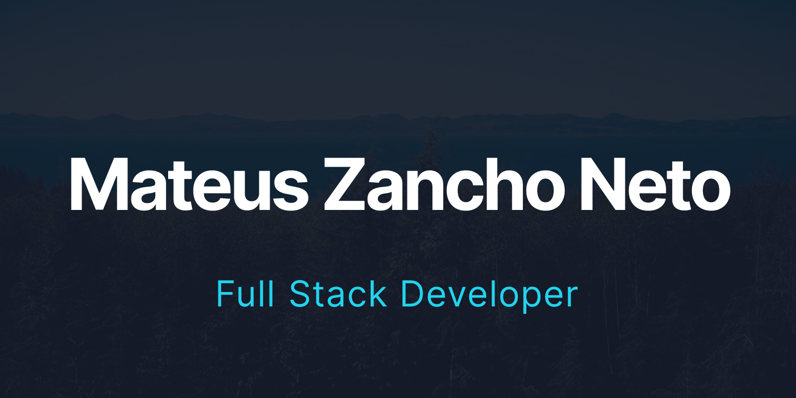
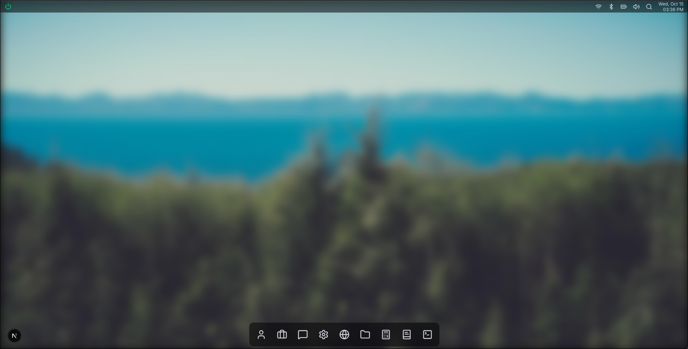
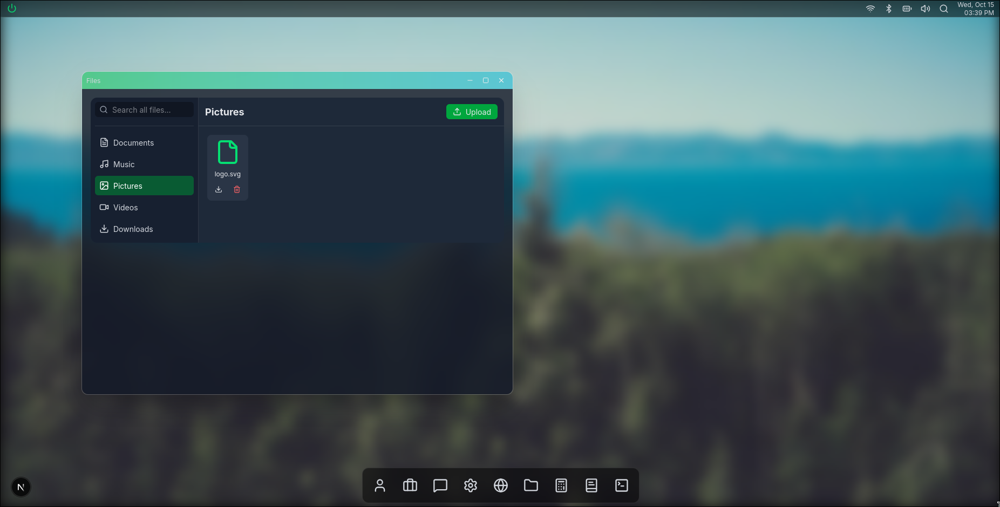
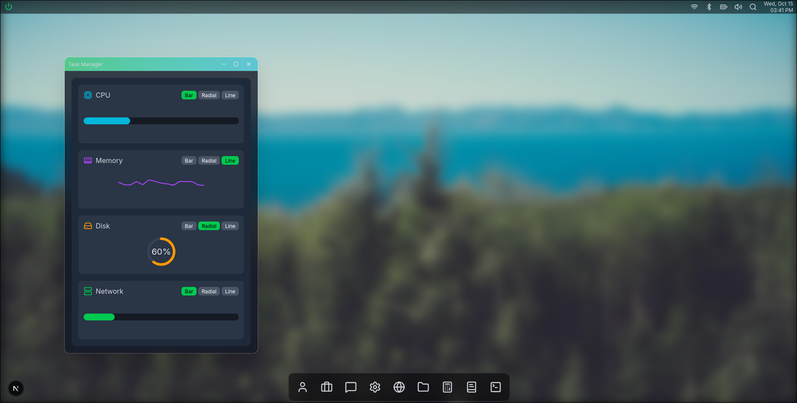
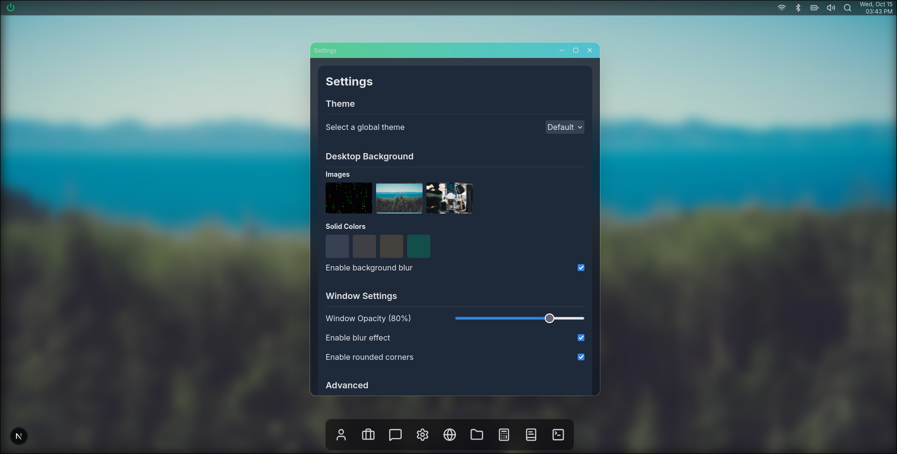
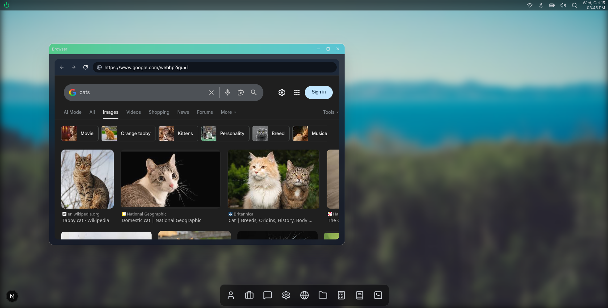
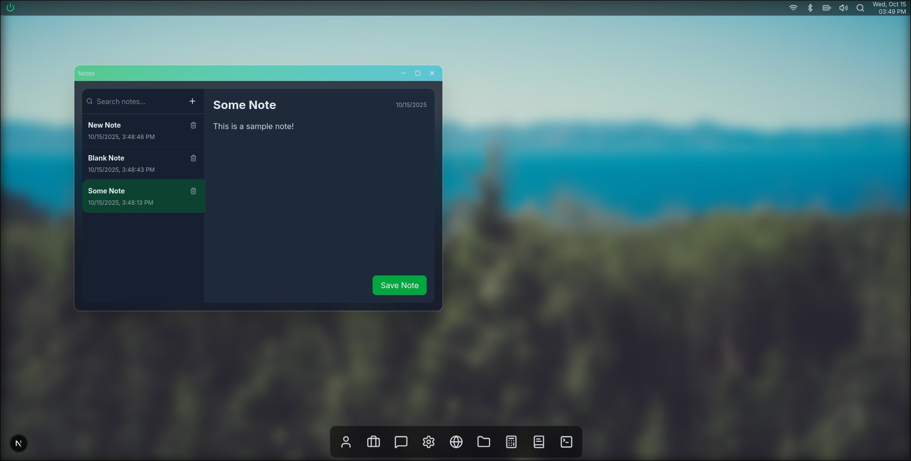
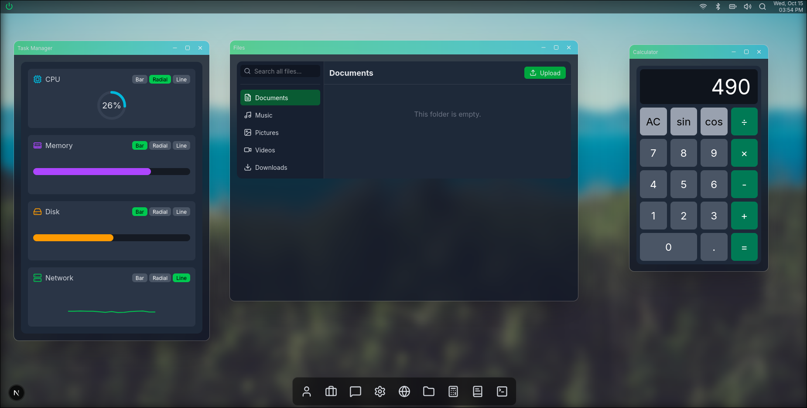

<div align="center">
  
  <h1 style="border-bottom: none;">zancho.dev - The Interactive Portfolio</h1>
  <p>
    An immersive, web-based desktop OS simulation built with Next.js and Redux, showcasing a portfolio of projects and technical skills.
  </p>

  <div>
    
    
    
    
    
    
    
  </div>
</div>

## ✨ Features

This project is a fully interactive and themeable desktop environment running in the browser, demonstrating a wide range of modern web development techniques.

#### 🖥️ Core OS & Windowing System

- **Draggable & Resizable Windows:** A custom window manager built with `react-draggable` and Redux.
- **Global State Management:** Centralized state management using Redux Toolkit for windows, settings, and application status.
- **Persistent State:** User settings and notes are saved to `localStorage`, providing a persistent experience across sessions.
- **Theming Engine:** Switch between a modern "Default" theme and a retro "Matrix" theme, with all components dynamically adapting.

#### 🚀 Applications Suite

- **About Me:** An auto-opening welcome application showcasing professional summary and skills.
- **Projects:** A data-driven portfolio display with categorized project cards and technology tags.
- **Browser:** A functional `<iframe>`-based web browser with history, navigation, and refresh capabilities.
- **File Manager:** A complete file management system with upload, download, delete, and global search functionality, backed by **IndexedDB** for client-side storage via `Dexie.js`.
- **Task Manager:** A real-time display of simulated system metrics (CPU, Memory, Disk, Network) with selectable chart types (Bar, Radial, Line).
- **Settings:** A comprehensive settings panel to customize the entire OS experience, including:
  - Global theme selection
  - Desktop background (images and solid colors)
  - Window opacity, blur, and corner rounding
  - Advanced window control styling (button size, style, title bar color)
- **Contact Form:** A fully functional contact form that sends emails via a Next.js API Route using **Nodemailer**.

#### 🎨 UI & UX

- **Modern UI:** Styled with **Tailwind CSS** for a clean, responsive, and utility-first design.
- **Smooth Animations:** Fluid animations and transitions powered by **Framer Motion**.
- **Custom Components:** A suite of custom, reusable components for modals, toasts, tooltips, and more.
- **Iconography:** Consistent and clean icons provided by **Lucide React**.

## 🛠️ Tech Stack

This project leverages a modern, robust, and scalable technology stack.

| Category                | Technologies                                                                                                                                                                                                                          |
| ----------------------- | ----------------------------------------------------------------------------------------------------------------------------------------------------------------------------                                                          |
| **Frontend**            | [React.js](https://react.dev/), [Next.js](https://nextjs.org/) (App Router), [TypeScript](https://www.typescriptlang.org/), [Redux Toolkit](https://redux-toolkit.js.org/)                                                            |
| **Styling**             | [Tailwind CSS](https://tailwindcss.com/), [Framer Motion](https://www.framer.com/motion/)                                                                                                                                             |
| **Storage**             | [IndexedDB](https://developer.mozilla.org/en-US/docs/Web/API/IndexedDB_API) with [Dexie.js](https://dexie.org/) for the File Manager, `localStorage` for Notes and Settings, and [Redis](https://redis.io/) for caching the Firewall. |
| **Backend (API)**       | [Next.js API Routes](https://nextjs.org/docs/app/building-your-application/routing/route-handlers), [Nodemailer](https://nodemailer.com/), [Docker](https://www.docker.com/)                                                          |
| **Deployment**          | [Vercel](https://vercel.com/)                                                                                                                                                                                                         |

## 🚀 Getting Started

To run this project locally, follow these steps:

1.  **Clone the repository:**

    ```bash
    git clone https://github.com/MateusZanchoNeto/zancho.dev.git
    cd zancho.dev
    ```

2.  **Install dependencies:**

    ```bash
    npm install
    ```

4.  **Run the development server:**
    ```bash
    npm run dev
    ```

Open [http://localhost:3000](http://localhost:3000) with your browser to see the Web App.

Open [http://localhost:1080](http://localhost:1080) with your browser to see the Mailcatcher UI.

## 🖼️ Project Showcase

A glimpse into the interactive desktop environment.

<div align="center">

**Desktop**


---

**File Manager with IndexedDB**


---

**Task Manager & Settings Panel**

<table>
  <tr>
    <td></td>
    <td></td>
  </tr>
</table>

---

**Browser & Notes Applications**

<table>
  <tr>
    <td></td>
    <td></td>
  </tr>
</table>

---

**Multiple Windows in Action**


</div>
